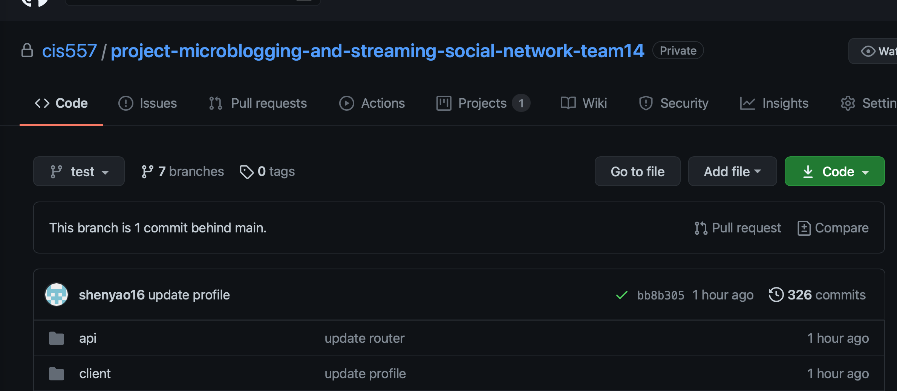
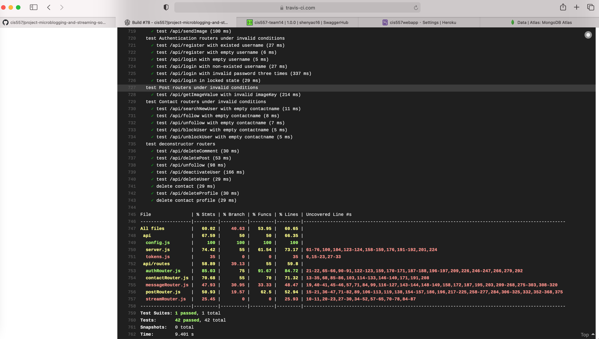
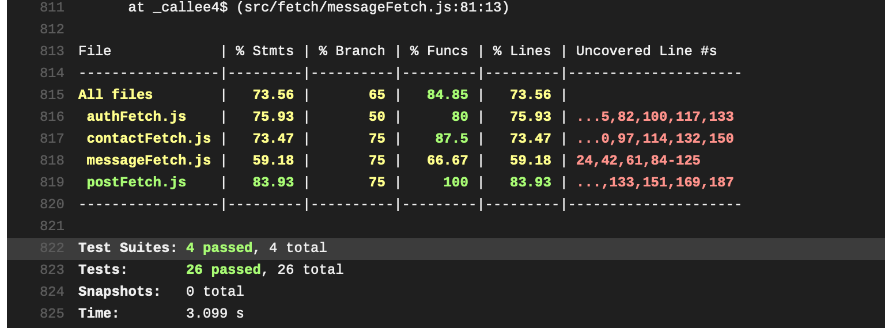
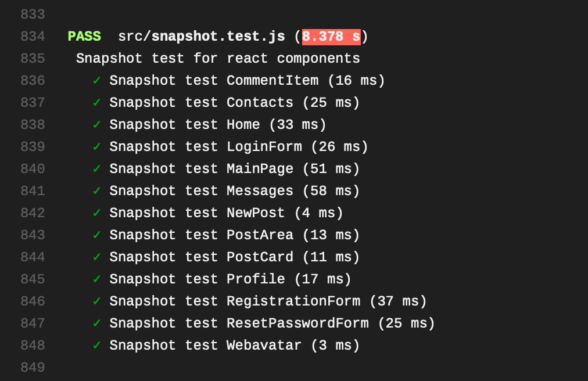

# A Twitter-like Social Network Web Application

## Deployment

[Webapp-Heroku](https://cis557webapp.herokuapp.com/)

### Test

#### Funcional Test

Functional test with selenium should be tested locally. Firstly install all the packages:

```shell
cd api && npm install
cd ../client && npm install
```

Our project relies on some env configurations, but we don't use `.env` considering security. In our deployment in Heroku, all the env settings are configured on Heroku setting page. To run functional test locally, we need to temporarily use `.env` file which is located in `doc/` directory. Please paste this `.env` under `api/` and start our webapp locally:

Open a terminal and run backend server:

```shell
cd api && npm start
```

Open another terminal and run react server:

```shell
cd client && npm start
```

Open the third terminal and run functional test:

```shell
cd client && npm run test-functional
```


#### Travis

Our Travis CI can be looked up through via test branch:



Our express router and database interactions are implemented together, so our API test and integration test are tested together, you can see from Traivs that all the API and integration test are passed and code coverage meets the requirement:




We also make unit test with mocking and the code coverage meets the requirement:



We run snapshot testing for react and more than half of the components are covered:



### Non-demo sections:

Please lookup our project Wiki to check all non-demo sections.
